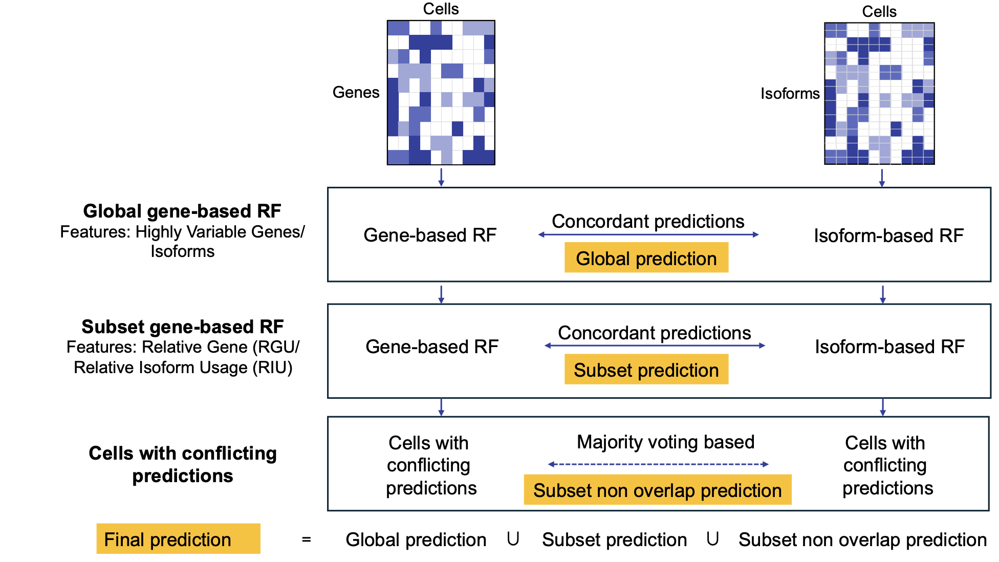

```{r, include = FALSE}
knitr::opts_chunk$set(
  collapse = TRUE,
  comment = "#>",
  eval = FALSE
)
```

# ICON: Isoform-Cell-type Classification via Overlapping Networks

ICON is an R package for cell type classification from single-cell RNA-seq data. It uses a **hierarchical Random Forest approach** that combines both **isoform-level** and **gene-level** expression to improve classification accuracy.

---

## Installation

```{r}
# Install devtools if needed
install.packages("devtools")

# Install ICON from GitHub
devtools::install_github("https://github.com/jithmaWijeward1/ICON")
```

### Dependencies

ICON requires the following R packages (installed automatically):

| Package | Purpose |
|---|---|
| `Seurat` | Single-cell data handling |
| `SeuratObject` | Seurat object infrastructure |
| `randomForest` | Random Forest modelling |
| `dplyr` | Data manipulation |
| `ggplot2` | Visualisation |
| `Matrix` | Sparse matrix operations |
| `openxlsx` | Export predictions and top features |
| `tools` | File extension detection |

---

## Quick Start

The entire pipeline runs with a single call to `ICON()`. Provide four Seurat objects (isoform and gene, training and testing), and cell type annotation file, and ICON returns predicted cell types and the top contributing features from each Random Forest model.

```{r}
library(ICON)

result <- ICON(
  isoform_train   = readRDS("isoform_train_data.rds"),
  isoform_test    = readRDS("isoform_test_data.rds"),
  gene_train      = readRDS("gene_train_data.rds"),
  gene_test       = readRDS("gene_test_data_.rds"),
  annotation_file = "Annotation_file.txt",
  barcode_col   = "cell_id",
  cell_type_col = "cell_type",
  assign_test_cell_types = TRUE,
  nfeatures       = 2000,
  top_n           = 100,
  nfeatures_model = 500,
  ntree           = 100,
  seed            = 241,
  verbose         = TRUE
)
```

### Accessing Results

```{r}
# Predicted cell types for all testing cells
head(result$final_predictions_df)

# Top Random Forest features by model
result$rf_top_features$Global_Isoform
result$rf_top_features$Global_Gene
result$rf_top_features$Subset_Isoform
result$rf_top_features$Subset_Gene

# Accuracy metrics (computed when testing cells contain cell type labels)
result$global_isoform_accuracy
result$global_gene_accuracy
result$global_overlapping_accuracy
result$subset_overlapping_accuracy
result$final_combined_accuracy
result$confusion_matrix

```

### Exported Excel files

The following files are generated in the working directory:

- `RF_Top_Features.xlsx`: Top Random Forest features identified by each model.
- `ICON_Final_Predictions.xlsx`: Final predicted cell types for all test cells.

When `assign_test_cell_types = TRUE`, evaluation metrics including accuracy values and confusion matrix are additionally returned.
---

## Input Files

| Argument | Format | Description |
|---|---|---|
| `isoform_train` | Seurat object| Isoform count matrix for training dataset |
| `isoform_test` | Seurat object | Isoform count matrix for testing dataset |
| `gene_train` | Seurat object | Gene count matrix for training dataset |
| `gene_test` | Seurat object| Gene count matrix for testing dataset |
| `annotation_file` | `.csv`, `.tsv`, or `.txt` path | Cell barcode-to-cell type mapping |

**Input requirements**

- `isoform_train`, `isoform_test`, `gene_train`, and `gene_test` should be supplied as Seurat objects.
- `annotation_file` is required for training datasets to assign cell type annotations.
- For testing datasets, `annotation_file` is only required when `assign_test_cell_types = TRUE`; otherwise, it can be omitted.
- The annotation file must contain at least two columns: one containing cell barcodes and one containing cell type labels. Column names are specified using `barcode_col` and `cell_type_col`.
- Training and testing isoform and gene Seurat objects should contain identical cell barcodes within each split (i.e., isoform_train ↔ gene_train and isoform_test ↔ gene_test). Matching barcodes are      verified automatically using `validate_paired_datasets()`.

---

## Parameters

| Parameter | Default | Description |
|---|---|---|
| `barcode_col` | `"barcode"` | Barcode column in the annotation file |
| `cell_type_col` | `"cell_type"` | Cell type column in the annotation file |
| `nfeatures` | `2000` | Variable features for preprocessing |
| `top_n` | `100` | Top features per cell type for RIU/RGU |
| `nfeatures_model` | `500` | Features used during RF training |
| `ntree` | `100` | Number of trees in each Random Forest |
| `seed` | `241` | Random seed for reproducibility |
| `export_predictions_file` | `"ICON_Final_Predictions.xlsx"` | Excel export path for final predictions (`NULL` to skip) |
| `export_features_file` | `"RF_Top_Features.xlsx"` | Excel export path for top RF features (`NULL` to skip) |
| `assign_test_cell_types` | `FALSE` | Assign cell types to test cells from the annotation file; set `TRUE` to calculate accuracy |
| `verbose` | `TRUE` | Whether to print progress messages |

- **Cell type prediction for unknown datasets (recommended use case):**
  - Set `assign_test_cell_types = FALSE`.
  - Test datasets do not require cell type annotations.
  - ICON returns predicted cell types and top contributing features.
  - Accuracy metrics are reported as `NA` because true test labels are unavailable.

- **Benchmarking ICON performance:**
  - Provide cell type annotations for both training and testing datasets.
  - Set `assign_test_cell_types = TRUE`.
  - ICON evaluates predictions against the provided test labels.
  - Accuracy metrics and confusion matrix are returned.

---

## How ICON Works



1. **Prepare training datasets** — normalise, find variable features, assign cell types, scale and run PCA for isoform and gene training objects.
2. **Prepare testing datasets** — same preprocessing for isoform and gene test objects.
3. **Validate paired datasets** — confirm isoform and gene objects contain matching cell barcodes.
4. **Compute RIU/RGU** — calculate relative isoform usage and relative gene usage from training cells only.
5. **Global RF models** — train one RF on isoform features and one on gene features; predict on test data.
6. **Compare global predictions** — cells where both models agree form the *global overlap* (high-confidence predictions). Disagreeing cells are passed forward.
7. **Prepare subset model data** — extract RIU/RGU top features for the non-overlapping cells.
8. **Subset RF models** — train a second pair of isoform and gene RFs on the cell-type-specific feature sets.
9. **Compare subset predictions** — cells where subset models agree form the *subset overlap*. Remaining cells default to the subset isoform prediction.
10. **Combine final predictions** — global overlap + subset overlap + subset non-overlap are merged into a single prediction table. Accuracy is calculated when test labels are available.

---

## Return Value

`ICON()` returns a list with:

| Element | Description |
|---|---|
| `final_predictions_df` | Final predicted cell types for all test cells |
| `rf_top_features` | Named list of top RF feature tables (`Global_Isoform`, `Global_Gene`, `Subset_Isoform`, `Subset_Gene`) |
| `global_isoform_accuracy` | Global isoform model accuracy, or `NA` |
| `global_gene_accuracy` | Global gene model accuracy, or `NA` |
| `global_overlapping_accuracy` | Accuracy on globally overlapping cells, or `NA` |
| `subset_overlapping_accuracy` | Accuracy on subset overlapping cells, or `NA` |
| `final_combined_accuracy` | Final hierarchical model accuracy, or `NA` |
| `confusion_matrix` | Confusion matrix for final predictions, or `NULL` |
| `rf_top_features_file` | Path to exported top-features workbook, or `NULL` |

---

## Example Datasets

### Early blood development dataset

- The Data folder includes example isoform- and gene-level Seurat objects, together with the corresponding cell type annotation file, derived from the early blood development dataset published by Wang et al. (2022). 
- These files can be used to familiarise yourself with the ICON workflow or to reproduce the example analysis.


```{r}
result <- ICON(
  isoform_train   = readRDS("isoform_train_data_Early_blood.rds"),
  isoform_test    = readRDS("isoform_test_data_Early_blood.rds"),
  gene_train      = readRDS("gene_train_data_Early_blood.rds"),
  gene_test       = readRDS("gene_test_data_Early_blood.rds"),
  annotation_file = "Early_blood_cell_type_annotation.txt",
  barcode_col     = "sample",
  cell_type_col   = "stage"
)
```

## Individual Functions

The helper functions are also available individually for users who want to run specific steps or customise the pipeline:

| Function | Description |
|---|---|
| `prepare_seurat_dataset()` | Import, preprocess, assign cell types, and run PCA |
| `validate_paired_datasets()` | Validate matching barcodes in isoform/gene pairs |
| `import_count_matrix()` | Validate and import a Seurat object |
| `preprocess_data()` | Normalise and find variable features |
| `assign_cell_types()` | Add cell type labels from annotation file |
| `calculate_relative_feature_usage()` | Compute RIU/RGU top features |
| `extract_expression_data()` | Extract expression matrices and labels |
| `train_random_forest()` | Train a Random Forest classifier |
| `get_top_rf_features()` | Extract top RF features by cell type |
| `predict_cell_types()` | Predict cell types on test data |
| `evaluate_predictions()` | Confusion matrix and accuracy metrics |
| `identify_overlapping_cells()` | Find cells where both models agree |
| `evaluate_overlapping_predictions()` | Evaluate accuracy on overlapping cells |
| `combined_final_predictions()` | Combine all predictions into final result |
| `export_rf_top_features()` | Export top RF features to Excel |
| `Final_prediction_UMAP()` | UMAP plot coloured by predicted cell type |

---

## Citation

If you use ICON in your research, please cite:

> Wijewardena H, Wu S, Schmitz U. ICON: An isoform-aware hierarchical random forest model for cell type classification 2026. https://doi.org/10.64898/2026.04.28.721306.

---

## License

This package is licensed under the MIT License.
